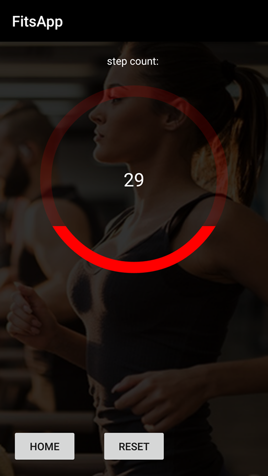
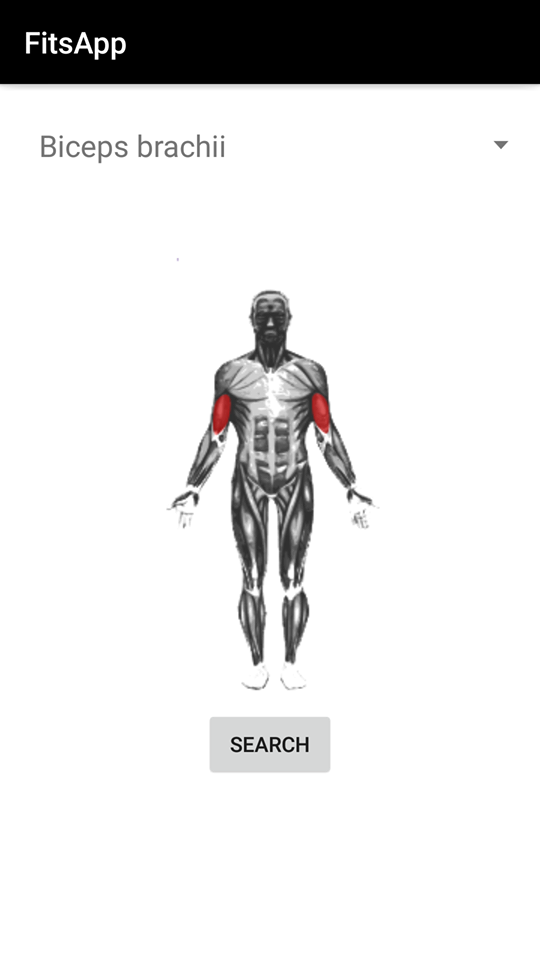

# Process

## Week 1
### Monday & Tuesday
I spent some time thinking about where my app should consist of. I want my app to have a step counter, and an activity where the user can see a map with his current location, and a route that can be plotted based on the current location.
I made a start with the first activity: The step counter.

### Wednesday
I spent some time designing the buttons of the app with Adobe Photoshop CS6 and thinking how the UI would look like. I made the activities my app should consist of.
I wanted another activity: one that fetches data from an exercises API, where the user can look up for certain exercises.

### Thursday 
The Step Counter works, and the MainActivity of the app is divided into four activities.
 

### Friday
After the presentation, I wanted to make a start with the exercises activity. I was investigating the API and the data structure that will be fetched from the API.

## Week 2
### Sunday & Monday
I began with the interface of the exercises activity, consisting of a searchbar and searchbutton.

I started investigating and working with the exercises API. After a while, I was able to get a response from the API.
I came up with a problem: the API doesn't work in a way that the user can look up certain exercises. They may do this, but then the query has to be the exact name as in the API. There is not a search function implemented in the API. So an user can not search for "push" and get "Push Ups" as result. This caused a problem because I intended to make the user look up for exercises with a searchbar.
I had to think and change how I was going to do this.

### Tuesday
The way the API worked, I had to change things around. 
After further investigating, I chose to let the user select a certain musclegroup they want to train, and based on that choice, the exercises shall be shown. 

I made a new interface, deleting the searchbar and the searchbutton.
I added a list (Spinner) with all the musclegroups available in the database. Based on that the data of the exercises will be fetched that are used to train the selected musclegroup.

### Wednesday & Thursday
(Got sick though.)
Finishing the main part exercise activity. I struggled at fetching the image data, because the images where in another place in the API.
The images are not at the same location as the exercise description, name, etc.
After a while I figured it out.

I started implementing Google Maps in my app for the running activity. The map does work, but the functionality of the activity is still minimal. I failed to plot a route, but I intend to work on this later on.

### Friday
Presentation

## Plans for Week 3
- Make it possible for the user to save data. (Finish implementation FireBase)
- Add more navigation functionalities. (drawer)
- Finishing the Running activity.

## Week 3
### Sunday
I thought about the design of the app, and how the navigation would work. I decided to have a navigation in the action bar with the use of icons.
I designed the icons and the background themes of the app.

### Monday and tuesday
I changed the UI of my app, to what I find more appealing to the eye. I have chosen for a dark theme with the use of simple flatdesign icons to navigate. I also made it possible for the user to set a certain goal for the step counter activity. The amount of steps set by the user will be saved locally. I set up FireBase to make it able for users to log in. 

### Wednesday and Thursday
I tried to make the running activity work. I stumbled on this, because this was more difficult than I expected. The tutorial I followed did not result in something i'd like it to result to. Instead of the running activity I've decided to focus on the parts I know sure of that they will be working. I've changed the number of steps inside the circular progressbar into a percentage. And I implemented a number of steps counted that could't be resetted. This digit will be the total amount of steps. I made a beginning with the achievements activity. It is currently not working perfectly.

### Friday
Presentation, and further bug fixing with with the step counter. The step counter caused more difficulties than I expected.

## Week 4
### Monday
The text in the spinner list in the exercises activity contains musclegroup that are in latin. Translating the latin words took more time than I expected. At last I found a solution that only translated the words and did not affect anything from the rest of the activity. 

### Tuesday
The total amount of steps will be updated every time the stepcount activity is running. The data that is stored locally will also be stored in FireBase.

### Wednesday
Fixed a major bug in the stepcount activity that caused the app to crash. The activity didn't saved the right number to FireBase and sometimes even "0". This caused a nullpoint exception in the achievements activity.

