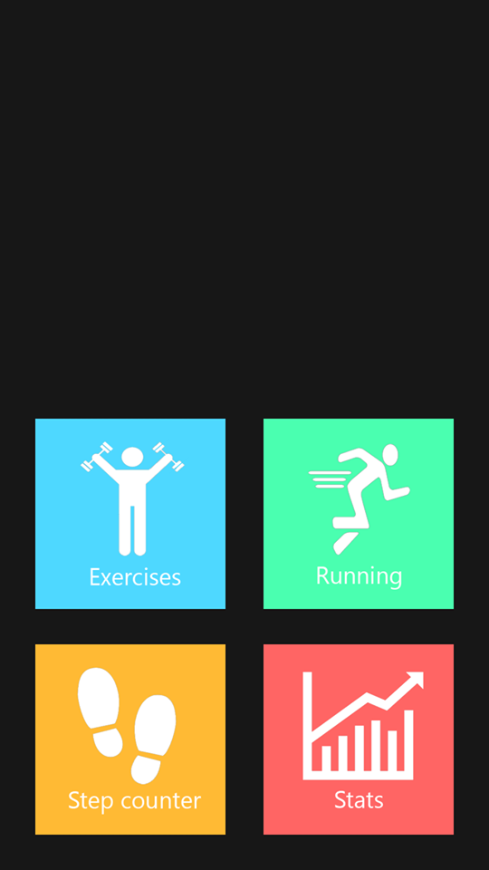

# Process

## Week 1
### Monday & Tuesday
I spent some time thinking about where my app should consist of. I want my app to have a step counter, and an activity where the user can see a map with his current location, and a route that can be plotted based on the current location.
I made a start with the first activity: The step counter.

### Wednesday
I spent some time designing the buttons of the app with Adobe Photoshop CS6 and thinking how the UI would look like. I made the activities my app should consist of.
I wanted another activity: one that fetches data from an exercises API, where the user can look up for certain exercises.

### Thursday 
The Step Counter works, and the MainActivity of the app is divided into four activities.
 

### Friday
After the presentation, I wanted to make a start with the exercises activity. I was investigating the API and the data structure that will be fetched from the API.

## Week 2
## Plans for Week 3
