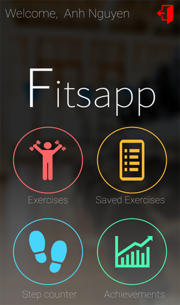

# Fitsapp
## Overview
Fitsapp is a fitness app that users can use to start working out. This app consists of multiple activities the user can choose to do, 
whereas most(free) fitness app on the app store only consists of one component. The app consists of 4 activities: a step counter, an exercise database, an achievements page, and a list consisting all the exercises the user chose to save.

## Technical Design
### Login
The first time a new user opens the app, a sign in page will appear where the user can login with their google account or with e-mail.
The app communicates with FireBase and Google to login of sign up.
On signing in for the first time, an user creates an unique ID which is created in FireBase: the online database this app uses to store data. The user will be headed to the main activity or homescreen when logged in. Users don't have to login again the next time, if the user restarts the app. They will see the homescreen unless the user is not logged in. 

### Activities
In the homescreen, the user can head to four activities, or log out. The first activity in the app is a step counter.
The step counter uses a sensor in android devices (step count sensor) and shows the user how many steps the user has taken since the last reset. The stepcount activity saves two digits: a step count since reset, which shows the current progress and a the total amount of steps the user has taken since the first signup. The step count since reset is stored locally and the total amount of steps is stored online.
The step count since reset is only stored locally, because it's only task is to show the user how much the user has progressed since resetting the step counter. The total amount of steps is saved online, because this data is needed for another activity: the achievements activity. The user can set a certain amounts of step he/she wants to take. This will be a personal goal.  
Depending on the set goal, a circular progress bar will be shown with a percentage, where the progress will be shown, if the users are coming closer to their goal.
This activity also consists of two buttons: one for resetting the current amount of steps taken and another one to enter the user's goal.

The second activity is the exercises database. This activity uses the API of wger.de, which is an online database consisting of muscle groups, exercises etc. 
On starting the activity, the user will see a spinner listview, and an image of a man. The image of a man is an image where a certain muscle group is highlighted, depending on the selected muscle group in the spinner. The user can select one of the 15 muscle groups in the list, and the image of the man changes accordingly, so that the user knows which group of muscles they are targeting in their body when selecting a muscle group in the list. 
Depending on the choice, the app searches for exercises that targets the selected muscle group. The user will see what they have selected in the title (the muscle group in latin), and a list consisting of exercises. On clicking on of the items in the list, the user will be headed to another activity, which show the description of the exercise and the images, showing how it should be done. On this activity, there is a save button where the user can save the current exercise. This data will also be saved in FireBase. The name of the exercise is the key, and the value will be the ID of the exercise.
The name of the exercise is needed to fetch the description from the API and the ID of the exercises is needed to fetch the images from the database. The images are not included in the same path as the exercises information, which was actually pretty hard to deal with, but this will be discussed later on in this report.

The third activity is a simple listview consisting of all the saved exercises. Clicking an exercise will show the exercise description and image, and long-clicking an item will cause the exercise to be deleted from the list, and in FireBase.

The fourth activity an achievements activity, where the user can keep track of his progress since using the app. This activity is used to motivate the user. The app consists multiple progress bars, which will slowly fill as the user completes certain tasks, like: have a total step count of 1000, or 5000 etc.

### Navigation
Each activity consist of a action bar, where the user can head to every main activity in this app.
The navigation consists of icons. This choice will be discussed later on.

## In Detail
If an user starts the app for the first time, the user will see a login screen where the user can sign up with a Google account, or just with their e-mail. On login of signing up, the user will be connected to FireBase. The main activity will only be shown, when the user has logged in. The app remembers if the user is logged in or not.
The mainactivity consists of 4 main buttons and a logout button. If the user wants to log out, a snackbar (for comnfirmation) will be shown. Only if the user confirms the logout, the user will be logged out. This is to avoid logging out accidently. 

The first button leads to the exercises activity. This activity uses an API (wger.de) to fetch data of muscle groups. These muscle groups are listed in a spinner. The center of the activity is an image of a man with a highlighted muscle. The highlighted muscle will change accordingly to the selected muscle group in the spinner by the user. Each muscle group has an special ID, needed to fetch the exercises for that muscle group. However, this ID is unnecessary for the user, so the user doesn't see this ID. When the user has selected a muscle group and presses the search button, an intent will be given to the next activity, which is a listview consisting of exercises for the selected muscle group. Every exercise has an unique name and ID. When the user clicks on an exercise, an intent will be given to the next activity with the name and ID. The name is needed for the description, whilst the ID is needed to fetch the images of the exercises. The images are not in the same path as the exercises in the API, and this has caused some difficulties at first, but this will be discussed later on. The next activity is a page where the user can read the description of the exercise, and if the user likes to remember the exercise, he/ she can save the exercise. The exercise that is saved will be stored in FireBase. The name and the ID of the exercise will be stored. 

The second button (saved exercises) is a list containing all the exercises saved by the user. The name and the ID of the exercise will be fetched from FireBase. Clicking on an item in the ListView will lead to the activity with the description of the exercise.
Long-clicking will delete the exercise from FireBase and from the ListView. There is a help button, that shows a brief description of how this activity works.

The third button (Step Counter) is an activity that uses a sensor in Android devices to measure the amount of steps someone takes. This sensor is actually a sensor that senses small shocks. Every brief movement will cause the sensor to react. The activity consists of a progressbar, that will fill depending on the goal set by the user and the amount of steps the user has taken since the last reset.
There is also a reset button, that sets the progress of the circular progress bar at zero again, same as the amount of steps taken by the user. On usage of this button, a confirmation text will be shown. There also is another button which the user can use to set a certain goal to achieve. How closer the user comes to his/her goal, how more complete the progress bar is. There is a percentage in de middle of the progress bar. If the percentage reaches 100, the user will know that his goal is achieved. Every step taken by the user, the total amounts of steps, will be saved and stored in FireBase. 

This is needed for the fourth activity: the achievements activity. The amount of steps taken by the user will be fetched from FireBase, and depending on that amount, the user will be shown some progressbars. This activity also consist of a help button, for more explanation.

## FireBase 
Every user has their own unique ID on FireBase. This is used to save data from the activities. The data structure looks like this:

## Challenges
The first challenge was thinking about what I should implement and what is possible in 4 weeks of time. I've looked up how to build a step counter first. I thought this was easier than it would be. The variable that count steps, that I use to show the user, is not resetable by itself. It is a variable in the sensor of the device itself, so I couldn't set "variable = 0" when pressing a button. It took some time to find a way to solve this problem.

The second big challenge was the way the API I used was working. The API is pretty unfinished, so it is more chaotic than other well known API's. It is not possible with this API to look for certain words to find an exercise. So I had to change my plan, because at first I wanted to make it possible for the user to look up some exercises by themselves, using a search bar. The second problem with this API is that the images of the exercises are stored in a different path in the API. It was a struggle for me to fit the right image to the right exercises using two locations. At last I found a solution: the ID of the images are the same as the exercise number of the exercise.

Other challenges were the implemantation of the circular progress bars, and linking the activities in a way the app does not crash.

## Decisions
In the first week, I was thinking whether I wanted the app to be an online  app or not. I decided, that it may be more modern, to have a app that works with an online database, and where the user can login as well.
At first, instead of the saved exercises activity, I wanted to have a running activity which will plot a route. Halfway this project I had to discard this and focus on the other activities, because this will cost me too much time, and the other activities have to work as well.And with advise of the supervisor, I decided to discard the idea of this running activity.  That was the biggest decision in this project. For the exercises activity, I wanted to have a search bar for the user to look up exercises. I had to change this idea, because the API doesn't allow it to look up for some exercises. The term filled in has to be exactly the same as the exercise name in the database, otherwise there will be no result. So I decided to make the user choose a certain muscle group they want to train, and based on that choice, exercises will be shown. 

Other decisions are UI related. I chosed a mainly dark theme for my app. For navigation, every activity has an action bar with icons in it to navigate to the according activity. I mainly chose a flatdesign style of UI.

## If I had more time
If I had more time I may want to make the running activity work, which I discarded in week 2. It seems like a challenge. But in 4 weeks of time, I couldn't bother doing such a difficult task where this activity is only one of the four activities. I'd also like to expand the functions for my current activities. The achievent activity could also be expanded with more things to achieve.

